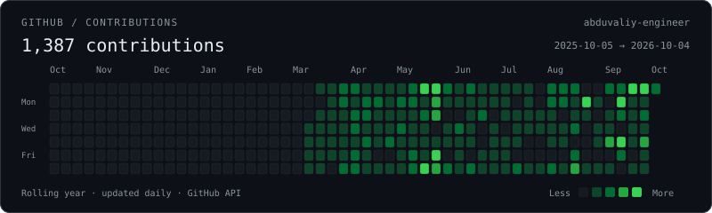

# Abduvaliy Abdulazizov

### Backend / AI Engineer · APIs, automation & infrastructure

I build backend services, AI integrations, automation, and infrastructure—from OCR pipelines and messaging systems to production APIs and data-backed dashboards.

`Python` · `FastAPI` · `Docker` · `PostgreSQL` · `Linux`

## What I build

- **Backend & AI services:** APIs, OCR pipelines, LLM integrations, and MCP services.
- **Automation & interfaces:** Telegram/Discord workflows and data-backed operational dashboards.
- **Infrastructure:** independent deployments, CI checks, migration safeguards, and production debugging.

## Selected work

**OCR + Telegram pipeline**\
Built and independently deployed a FastAPI/Ollama service connecting image ingestion, stored transcripts, and summaries; fixed repeating OCR output without losing genuine text.

**Computer-vision operations platform — team contributions**\
Connected React/TypeScript dashboards to live APIs; contributed camera management, detection/history workflows, authentication, tenant isolation, and PostgreSQL reliability fixes.

**Independent MCP infrastructure**\
Separated authentication, monitoring, and deployment from a legacy runtime; contributed Docker-stack migrations with backups, health checks, and data-integrity verification.

More work: personal automation & AI document export

**Solo-Tracker — personal project**\
Deployed a Discord productivity-tracker MVP with quests, XP/streaks, and weekly reports; added AI-generated quests and GitHub Actions CI. `Fastify` · `Vite` · `Docker`

**AI chat → PDF/DOCX export**\
Shipped Telegram answer exports with table formatting, duplicate prevention, and ordered split messages; fixed a slow-render lock bottleneck. `Ruby` · `Chatwoot` · `Telegram Bot API`

## Stack

| Area | Technologies |
| :--- | :--- |
| Languages | Python · JavaScript · TypeScript · SQL |
| Backend & UI | FastAPI · Express · React |
| AI & integrations | LLM APIs · Ollama · MCP · Telegram / Discord |
| Data | PostgreSQL · MySQL · Redis |
| Infrastructure | Linux · Docker / Compose · GitHub Actions · Nginx |
| ML / Data | pandas · NumPy · scikit-learn · model evaluation |

## Open source / Linux

**[Acer Nitro Linux camera fix](https://github.com/abduvaliy-engineer/acer-nitro-anv16s-camera-fix)**\
Traced a missing webcam to ACPI GPIO interrupt handling that cut its power. Verified a workaround, published reversible installer/check tooling, and submitted a Linux DMI-quirk patch upstream.

## Current focus

- Reliable AI-backed APIs, messaging integrations, and independently deployed services.
- AI-answer evaluation, source-grounded retrieval, and safe abstention.
- Linux hardware debugging and upstream contributions.

## GitHub activity

Refreshed daily by GitHub Actions · GitHub-reported contributions, not a commit count.

## Links

[GitHub](https://github.com/abduvaliy-engineer) · [Linux camera fix](https://github.com/abduvaliy-engineer/acer-nitro-anv16s-camera-fix)
